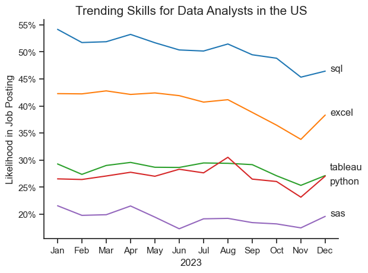
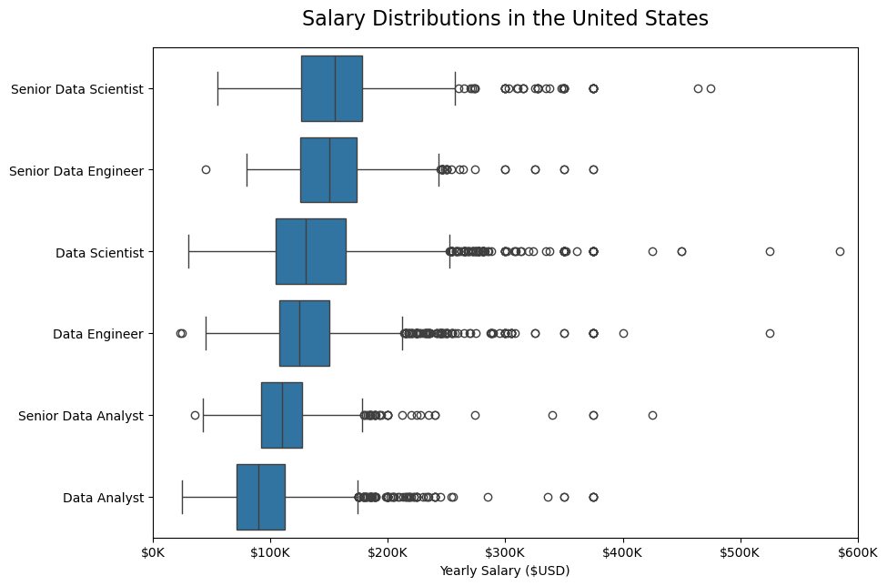
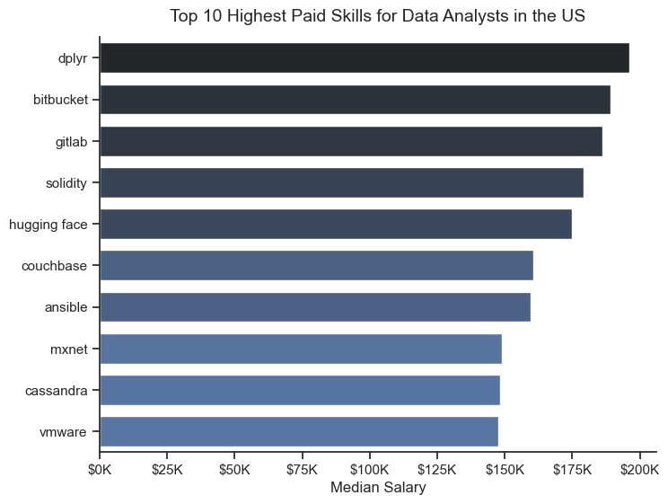
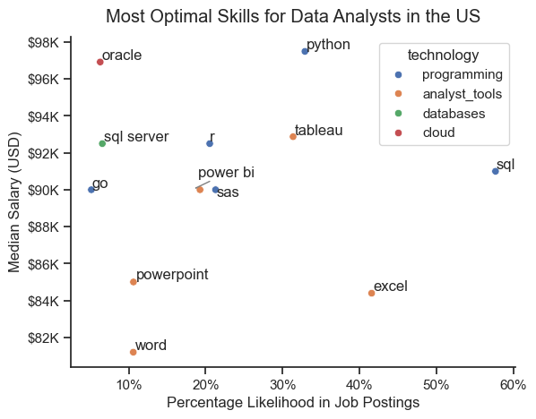

# Python-Job-Data-Analytics-Project
## Project Overview
The aim of this project is to investigate and understand the job market more throroughly. It delves into the top-paying and in-demand skills to help find optimal job opportunities specifically for data analysts in the United States.

For this project, I have imported a job postings dataset (in csv file format) that contains information on technology job postings worldwide for the year 2023. This includes detailed information such as  job titles, countries, salaries and essential skills. This will form the foundation for my analysis. 

Note: 
- 1_Basics and 2_Advanced Section folders contains separate notes on the use of different Python Libraries for my studies.
- 3_Project folder contains all the relevant files for this project analysis.

# Questions to Address
Below are the questions I will be focusing on in my project:

1. What are the most demanded skills for the top 3 most popular data roles?
2. How are in–demand skills trending for data analysts? 
3. How well do jobs and skills pay for data analysts?
4. What is the most optimal skill to learn for data analysts based on demand and salary?

For this analysis, I will be mostly focusing on Data Analyst Roles in the United States.


# Tools Utilized
For my analysis into the data analyst job market, I displayed use of several key tools:
- **Python**: Enables analysis of the imported data to find critical insights. I also used the following Python libraries:
  - Pandas Library: Used to manipulate and analyze the data.
  - Matplotlib Library: Used to visualize the data.
  - Seaborn Library: Helped me create more advanced customizations.
- **Jupyter Notebooks**: The tool I used to run my Python scripts which includes my notes and analysis.
- **Visual Studio Code**: For executing my Python scripts.
- **Git & GitHub**: Essential for version control and sharing my Python code and analysis, ensuring project tracking.

# Data Preparation and Cleanup
I start by importing necessary libraries and loading the dataset, followed by initial data cleaning tasks to ensure data quality.

```python
import ast
import pandas as pd
from datasets import load_dataset
import matplotlib.pyplot as plt
import seaborn as sns
#importing libraries

dataset = load_dataset('lukebarousse/data_jobs')
df = dataset['train'].to_pandas()
# loading data

df['job_posted_date'] = pd.to_datetime(df['job_posted_date'])
df['job_skills'] = df['job_skills'].apply(lambda x: ast.literal_eval(x) if pd.notna(x) else x) 

#data cleanup
```
To focus my analysis on the U.S. job market, I apply filters to the dataset, narrowing down to roles solely based in the United States.

```python
df_US = df[df['job_country'] == 'United States']
```


# The Analysis
Each Jupyter notebook for this project aimed at investigating specific aspects of the data job market. Here’s how I approached each question:

## 1. What are the most demanded skills for the top 3 most popular data job roles?
To find the most demanded skills for the top 3 most popular data job roles, I filtered for the top 3 most popular technology roles by job posting- this included data analysts, data scientists and data engineers- and identified the top 5 skills for each respective role. This provides information on the key skills to focus on depending on the job role being targeted.

View my notebook with detailed steps:
[2_Skills_Count.ipynb](3_Project/2_Skills_Count.ipynb) 

## Results


## Insights
- Python is a versatile skill that is in high demand acorss all 3 data jobs, in particular for data scientists (72%) and data engineers (64%).
- SQL is also a very sought after skill, which is most requested for Data Analyst and Data Engineer job postings (both >50%).
- Compared to data analysts and data scientists, data engineers require more specialised technical skills that revolves around cloud technology (AWS, Azure, Spark). Conversely, both data analysts and data scientists utilise more general data management/visualisation tools.


## 2. How are in-demand skills trending for data analysts?

To find how in-demand skills trend throughout the year, I aggregated monthly counts for the top 5 skills for data analysts and calculated the likelihood of these skills appearing in job postings each month. This enables data analyst job seekers to prioritise learning skills that recruiters are looking for and potentially avoid skills that might be deprecated in the future. 

View my notebook with detailed steps:
[3_Skill_Trend.ipynb](3_Project/3_Skill_Trend.ipynb)

## Results

*Line graph visualizing the trending top skills for data analysts in the US for 2023*

## Insights
- SQL remains the greatest demanded skill for data analysts, although it has experienced a gradual decline in demand throuhgout the year.
- Excel is the second most in-demand skill following SQL, with a similar gradual decline in demand ranging between a likelihood of approximately 35-42%. However, from November onwards, the percentage value has sharply risen.
- Both Python and Tableau experienced fluctuations throughout the year, but have remained relatively steady in demand 
- SAS is the least in-demand skill of the plot, ranging between the 17%-22% mark.

## 3. How well do jobs and skills pay for data analysts?

To find how well data jobs pay, I  filtered for the top 6 most popular technology roles in the United States and visualised their salary dsitributions. In addition to this, I then narrowed my analysis to data analyst roles, and identified the top 10 highest-paying skills based on median salary.  

View my notebook with detailed steps:
[4_Salary_Analysis.ipynb](3_Project/4_Salary_Analysis.ipynb)

## i) How well do data jobs pay?


## Results

*Box plot visualizing salary distributions for the top 6 data job titles for 2023*

## Insights
- Senior data scientists and senior data enginners roles offer the greatest median salaries amongst the job titles, reflecting senior level compensation and experience. Conversely, data analyst and senior data analyst roles have the lowest median salaries displayed, indicating their entry-level/mid-level nature within data.
- The range of salaries for data analysts and senior data analysts are narrower compared to distributions of other job titles, which could imply more standardized pay bands within these positions. Jobs like Senior Data Scientists, Data Scientists and Data Engineers show a wider range of salaries, with many outliers extending toward higher values. This suggests more variability in pay.
- Salaries for Senior Data Scientist and Data Engineer roles include extreme outliers that exceed $500K. This indicates that high-end salaries are more likely in advanced, specialized roles.

## ii) How well do skills pay for data analysts?

## Results


*Bar plot visualizing the highest paid skills for data analysts in the US*

## Insights
- dplyr has the greatest median salary, followed  by bitbucket and gitlab. This suggests that proficiency in these specific tools or technologies can increase earning potential for Data Analysts, likely due to the specialized nature of these tools. 
- Several skills in the top-paying category, such as bitbucket, gitlab, and ansible, are associated with version control, automation, and DevOps practices. This highlights an increasing trend where data analysts benefit from understanding not only data analysis but also broader software development practices.
- Interstingly, when compared to the subplot showing the top 5 demanded skills for data analysts under the first question, none of these top-paying skills are present. This suggests skills such as 'dplyr', 'Bitbucket', 'Gitlab' are not common amongst data analyst job postings in the US.

Data analysts aiming to maximize their career potential should consider developing a diverse skill set including high-paying, specialised skills (dependent on the sector of work) and demanded foundational skills.

## 4. What is the most optimal skill to learn for data analysts based on demand and pay?

To identify the most optimal skills to learn (the ones that are the highest paid and highest in demand) I calculated the percent of skill demand and the median salary of these skills. 

View my notebook with detailed steps:
[5_Optimal_Skills.ipynb](3_Project/5_Optimal_Skills.ipynb)

## Results

*Scatter plot visualizing the most optimal 13 skills (highest paying and high demand) for data analyst roles in the US*

## Insights
- The scatter plot shows that the majority of programming skills (coloured in blue) tend to cluster at higher salaries compared to other technology skill types, with Python and SQL located around the top-right region of the plot. This implies that programming knowledge can lead to greater salary benefits
- Analytical tools (coloured in orange), such as Tableau and Power BI, are prevalent amongst job postings and offer competitive pay given their location around the centre of the plot. Excel is an analytical tool tha has a high likelihood in job postins (~40%-45%) but is associated witha lower median salary.
- Oracle and SQl server (cloud and  database technologies respectively) are less frequently mentioned in job postings (about <10%) but have high median salaries (~$93K–$97K).
  

# What I Learned

Throughout this project, I deepened my understanding of the data analyst job market and enhanced my technical skills in Python, especially in data manipulation and visualization. This includes:

- **Advanced Python Library Usage**: Using libraries like Pandas for data manipulation, Seaborn and Matplotlib for data visualization, and other libraries helped me perform complex data analysis tasks more efficiently.
  
- **Data preparation and cleaning**: I learnt the importance of preparing/cleaning the data before any analysis can be conducted to ensure the accuracy of the insights derived.
  
- **Data visualization and insight extraction**: I have explored the best practices for designing visualizations, such as choosing the right chart type (e.g., scatter plots, bar charts, line graphs) and using colors effectively to communicate insights more clearly.
  
# Challenges I faced
Some key challenges I came across when dealing with the data includes:

- **Handling missing data/inconsistencies**: At times I had to restart my analysis due to incorporating data with inconsistent entries, emphasising the importance of using high-quality data for analysis. 
  
- **Complex data visualisations**: Creating more complex, customizable visualisations was challenging at times, in particularly when dealing with labelling specific values and formatting.


# Conclusion
In this project, we explored the landscape of the data analyst job market in the US. This has highlighted key skills that align with high demand and competitive salaries, such as SQL, Python, and data visualization tools.

Ultimately, this project serves as a data-driven guide to making informed career decisions in a rapidly evolving field, offering insights for navigating and thriving in the data analytics job market.