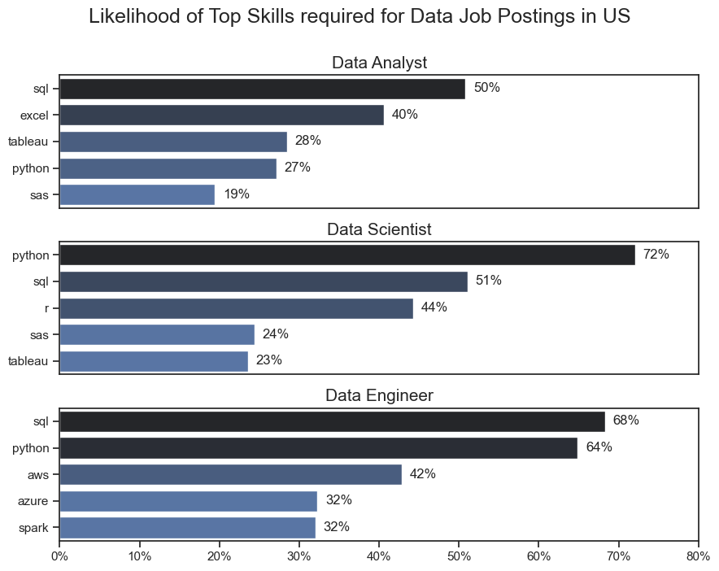

# Python-Data-Analytics
# Python-Data-Analytics
## Aims of this project
The aim of this project is to analyse...For this project, I have imported a job postings dataset (in csv file format) that contains information on technology job postings worldwide for the year 2023. This includes information such as job countries, salary year average, job skills, company name etc. 

## 1. What are the most demanded skills for the top 3 most popular data job roles?
To find the most demanded skills for the top 3 most popular data job roles, I first filtered for job postings solely located the US and identified the top 3 most popular technology roles by job posting- this included data analysts, data scientists and data engineers. This was then followed by exploding the 'job_skills' column to identify the top 5 skills for each respective job title by count. This provides information on the key skills to focus on depending on the job role being targeted.

## Visualize Data

## Insights
- Python is a versatile skill that is in high demand acorss all 3 data jobs, in particular for data scientists (72%) and data engineers 
(64%)
- SQL is also a very sought after skill, which is most requested for Data Analyst and Data Engineer job postings (both >50%).
- Compared to data analysts and data scientists, data engineers require more specialised technical skills that revolves around cloud technology (AWS, Azure, Spark) . Conversely, both data analysts and data scientists utilise more general data management/visualisation tools.
